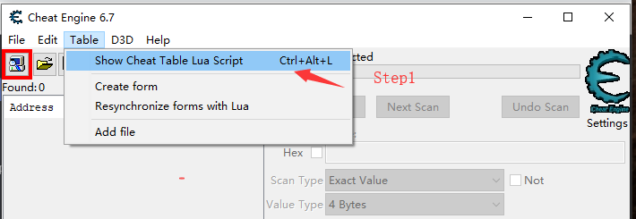
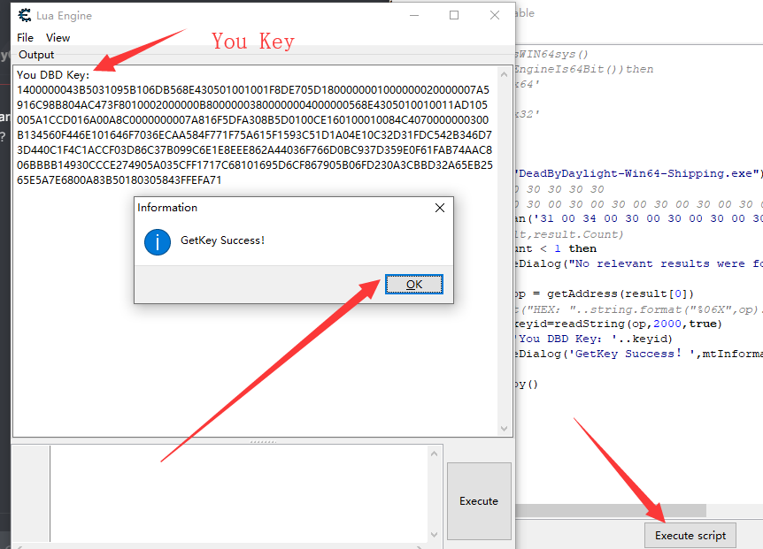
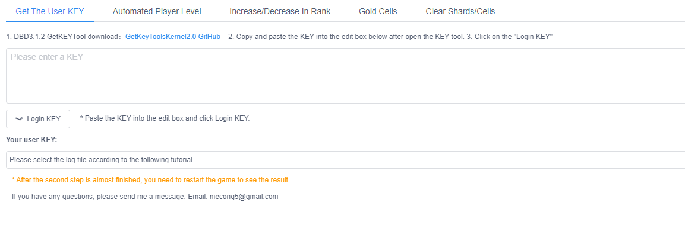

# Dead By Daylight 3.1.2+

DBD3.1.2 is Work (DBD3.1.2正常工作)

Fixed 3.1.2 Unable to get KEY token problem （修改3.1.2无法获取令牌KEY问题）

join our Discord server to get the latest news at any time! (你可以加入我们的Discord，已获取最新动态)

Dead By Daylight Hacking Group：https://discord.gg/um8jGc2   (我们的Discord服务器)

~~Download Link（下载地址）: <a href="https://github.com/xlsqwg/GetKeyToolsKernel/releases/download/2.0/GetKeyToolsKernel2.0.zip">DownLoad GetKeyToolsKernel2.0.zip</a>~~ 

>GetKeyToolsKernel2.0 已被检测到，过时，请不要使用! 请看下面最新方法
>GetKeyToolsKernel2.0 Has been detected, outdated, please do not use! Please see the latest method below

#New Update 2019/09/06 Get Key Method of Safe （新更新：获取KEY的安全方法）

###Step1 （步骤1）

> you need bypass (你需要绕过EAC)

###Step2 （步骤2）

> use `Cheat Engine` get the key (使用 `Cheat Engine` 获取KEY)

###Notice (提醒)

>#####Suitable for all future versions (DBD3.1.2+) 适用于未来所有版本

### LUA Script Code for Cheat Engine (Get DBD Key Script) 获取DBD KEY令牌的LUA脚本
```lua
openProcess("DeadByDaylight-Win64-Shipping.exe")
--31 34 30 30 30 30 30 30
--31 00 34 00 30 00 30 00 30 00 30 00 30 00 30 00
result=AOBScan('31 00 34 00 30 00 30 00 30 00 30 00 30 00 30 00')
--print(result,result.Count)
if result.Count < 1 then
      messageDialog("No relevant results were found or the system was not supported. It is recommended to restart the system.", mtError, mbOK)
else
      local op = getAddress(result[0])
      --print("HEX："..string.format("%06X",op).."->"..result.Count)
      local keyid=readString(op,2000,true)
      print('You DBD Key：'..keyid)
      messageDialog('GetKey Success！',mtInformation,2)
end
result.destroy()
```
##LUA script use / graphic tutorial（LUA脚本使用/图文教程）





##Hack Tools web version preview (骇客工具网页版预览图)


##Hack Tools Link
[Hack Tools For WEB](https://www.huayoubox.com/dbden/)

